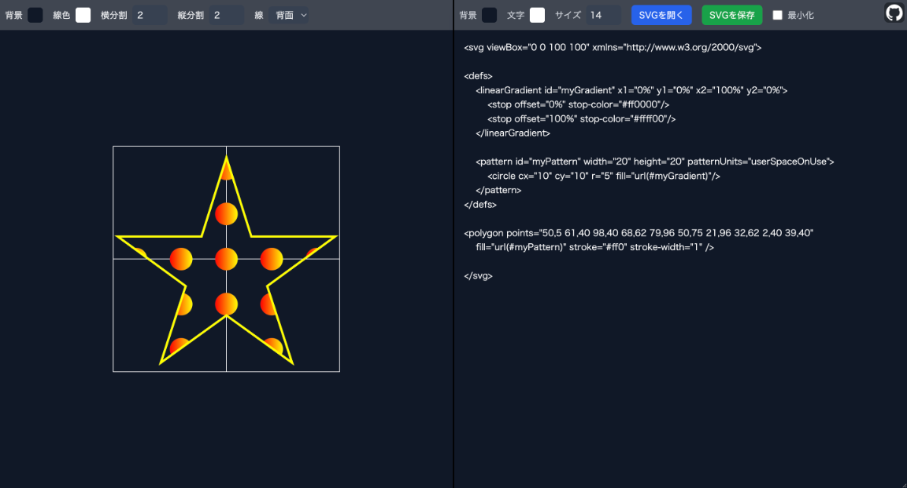

# minimal-svg-editor

## Recommended Environment
This tool is designed for use on a PC with the Google Chrome browser. Operation on other devices or browsers is not guaranteed.

## 推奨環境
このツールは、PC上のGoogle Chromeブラウザでの使用を想定しています。他のデバイスやブラウザでの動作は保証されていません。

## Demo
You can try this tool on the page below.

https://black-sesame-ice-cream.github.io/minimal-svg-editor/

## デモ
以下のページでこのツールを試すことができます。

https://black-sesame-ice-cream.github.io/minimal-svg-editor/

## Overview
A minimal web tool for real-time SVG editing and previewing.
It features live updates, file loading/saving, code minification, and an interactive preview with pan, zoom, and customizable grid lines. The editor and preview panes are also themeable.

## 概要
SVGのリアルタイム編集とプレビューを行うための、最小限のWebツールです。
ライブアップデート、ファイルの読み込み/保存、コードの最小化、そしてパン・ズーム・カスタマイズ可能なグリッド線を備えたインタラクティブなプレビュー機能が特徴です。エディタとプレビューのUIもカスタマイズ可能です。

## Usage
- **Real-time Editing:** Edit SVG code in the right-hand text area. Changes are reflected in the left-hand preview in real time.
- **Preview Interaction:** Use the mouse wheel to zoom and drag (left-click) to pan the preview.
- **Open SVG:** Click the "Open SVG" button to load a local SVG file into the editor.
- **Save SVG:** Click the "Save SVG" button to download the current content of the editor as an `.svg` file.
- **Minify:** Check the "Minify" box to view a minified (comments and extra whitespace removed) version of the code. The editor becomes read-only in this mode.
- **Grid Lines:** Use the controls in the preview panel ("H-Div", "V-Div") to display auxiliary grid lines over the SVG. You can also change the grid color ("Line Color") and its Z-order ("Line" - front/back).
- **UI Customization:** Use the color pickers and inputs at the top of each panel to customize the background color, text color, and font size for both the editor and the preview area.

## 使い方
- **リアルタイム編集:** 右側のテキストエリアでSVGコードを編集します。変更はリアルタイムで左側のプレビューに反映されます。
- **プレビュー操作:** マウスホイールでズーム、ドラッグ（左クリック）でプレビューをパン（移動）できます。
- **SVGを開く:** 「SVGを開く」ボタンをクリックすると、ローカルのSVGファイルをエディタに読み込みます。
- **SVGを保存:** 「SVGを保存」ボタンをクリックすると、エディタの現在の内容を `.svg` ファイルとしてダウンロードします。
- **最小化:** 「最小化」チェックボックスをオンにすると、コードの最小化版（コメントや余分な空白を削除）を表示します。このモードではエディタは読み取り専用になります。
- **グリッド線:** プレビューパネルの「横分割」「縦分割」コントロールで、SVGの上に補助グリッド線を表示できます。「線色」でグリッドの色を、「線」で前後（背面/前面）を変更することも可能です。
- **UIカスタマイズ:** 各パネル上部のカラーピッカーや入力欄で、エディタとプレビューエリアそれぞれの背景色、文字色、フォントサイズをカスタマイズできます。

## Licenses
Please see below for details.

[License](LICENSE/)

[Third-Party Licenses](THIRD-PARTY-LICENSES.txt/)

## ライセンス
以下を参照してください。

[ライセンス](LICENSE/)

[第三者ライセンス](THIRD-PARTY-LICENSES.txt/)

## Tech Stack
- HTML
- Tailwind CSS
- JavaScript (Vanilla)